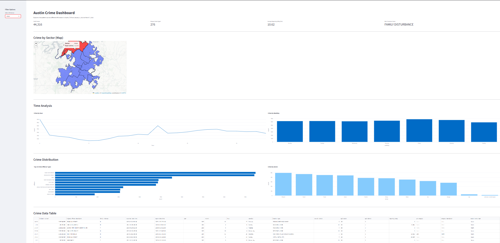
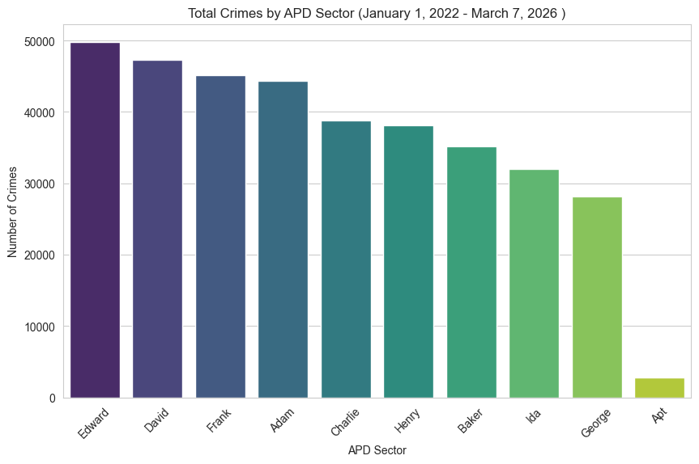
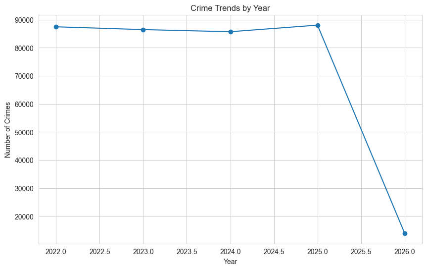
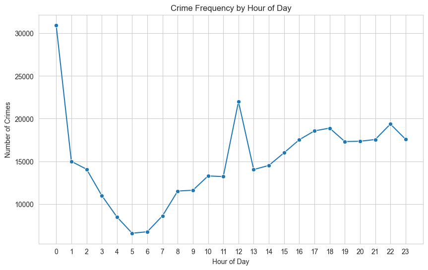
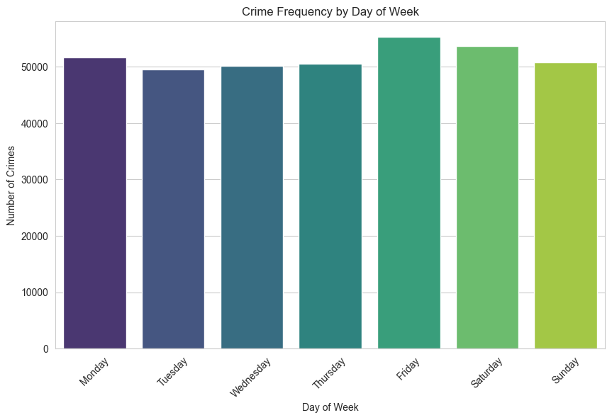
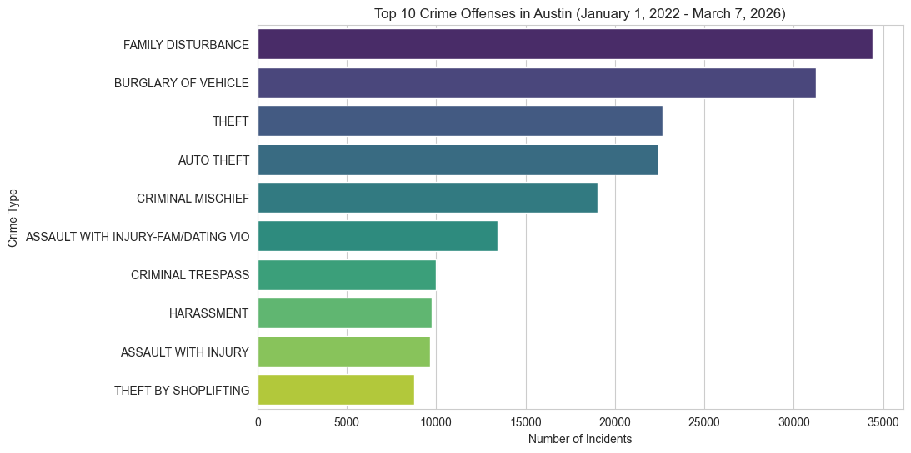
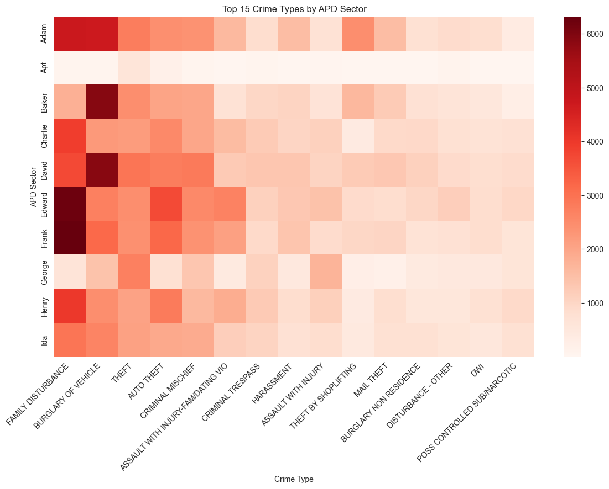
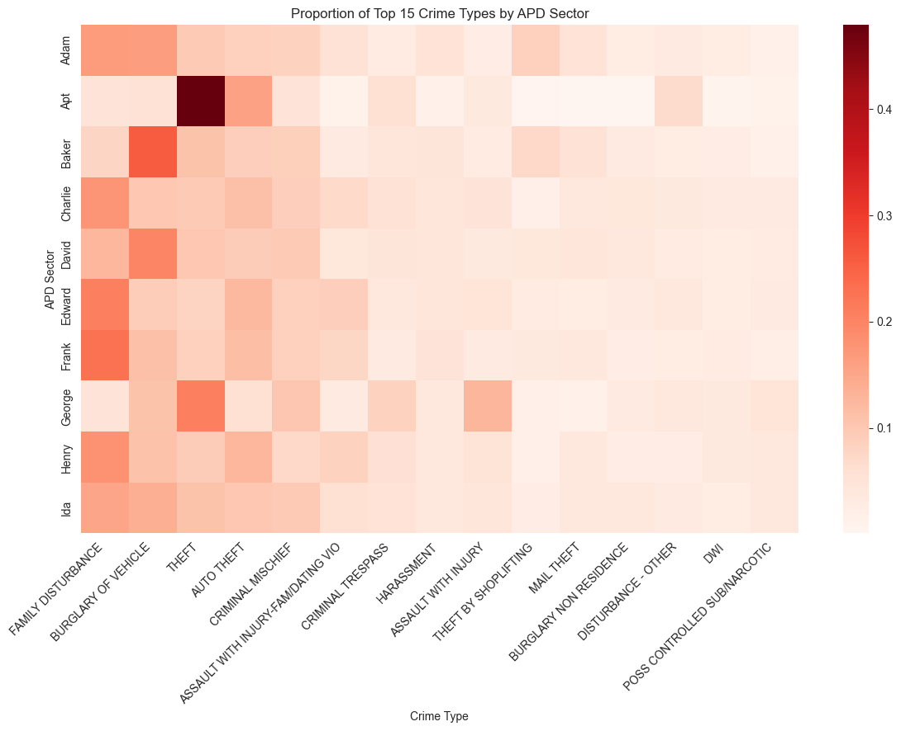

# Austin Crime Analysis Dashboard (Sector Focus)

## Project Overview
This project builds an **interactive geospatial crime analytics dashboard** that visualizes crime patterns across Austin Police Department (APD) sectors, using historical crime incident data (Jan 1, 2022 - March 7, 2026).

Crime incidents are aggregated by **official APD sectors** rather than relying on raw district codes for consistency and interpretability. The dashboard reveals **temporal trends, sector-level crime trends, and crime-type distribution**, enabling users to explore crime patterns dynamically.

### Main Questions Addressed:
- Which APD sectors experience the most crime?
- How do crime patterns vary by sector?
- When does crime occur most frequently?
- What crime types dominate specific sectors?

## Demo


## View Dashboard Here: https://austin-crime-dashboard.streamlit.app/

## Key Findings from Exploratory Data Analysis
Before building the dashboard, I conducted an exploratory data analysis to better understand patterns in the dataset and guide visualization design decisions.

1. Crime Distribution:
    - Certain APD sectors (e.g., Edward and David) consistently show higher overall crime volume.


2. Temporal Trends
    - Crime incidents appear relatively stable across Jan 01, 2022 to Mar 07, 2026.


3. Time of Day Patterns
    - Activity peaks significantly at midnight.


4. Weekly Trends
    - Friday and Saturday show the highest activity.


5. Crime Types
    - Most common incidences include family disturbances, burglary of vechicles, and theft.


6. Sector-Level Insights
    - While total volume varies, crime type distributions are broadly consistent across sectors, with some local variation.

### Sector-Level Heatmap Analysis
- Raw counts heatmap shows that sectors like Edward, David, and Frank experience higher crime volume.
- The normalized heatmap reveals that crime type distributions are largely consistent across sectors.
- The top 3 offense categories remain dominant across all sectors.
- Some sectors (e.g., Apt) show localized variation that is not visible in raw counts alone.




## Core Technologies Used
- Python (main programming language)
- Pandas (data cleaning & aggregation)
- GeoPandas (spatial joins with APD sectors)
- Folium (interactive mapping)
- Plotly (charts and visual analytics)
- Streamlit (dashboard interface)
- Shapely (geometry operations)


## Required Data
1. **Austin Crime Reports**
- Source: https://catalog.data.gov/dataset/crime-reports-bf2b7
- Key columns: 'highest_offense_description', 'occurred_date_time', 'apd_sector'

2. **Austin Police Department Districts**
- Source: https://data.austintexas.gov/Public-Safety/Austin-Police-Department-Districts/9jeg-fsk5
- Key columns: 'sector_name', 'the_geom'


## Project Structure
```
AUSTIN_CRIME_DETECTION/
├── dashboard/                    # Streamlit app and dashboard code
│   └── app.py
├── data/                         # Raw and cleaned data files
│   ├── apd_districts_clean.geojson
│   ├── apd_sectors.geojson
│   ├── austine_crime_reports_clean.csv
│   ├── other csv files...
├── images/                       # Screenshots and EDA visuals
│   ├── crime_count_by_sector.png
│   ├── normalized_heatmap.png
│   └── other images...
├── notebooks/                    # Jupyter notebooks for exploration and preprocessing
│   ├── 01_explore.ipynb
│   ├── 02_preprocessing.ipynb
│   └── 03_analysis.ipynb
├── README.md                    # Project overview
└── requirements.txt             # Python package dependencies

```

## Notes:
- APD sector boundaries are used for consistency; some sectors may span multiple districts.
- Large files (e.g., Crime_Reports.csv and austin-crime_reports_clean) are excluded from this repo to keep lightweight.
- The dashboard uses 'data/austin_crime_preprocessed.csv' , which is included.
